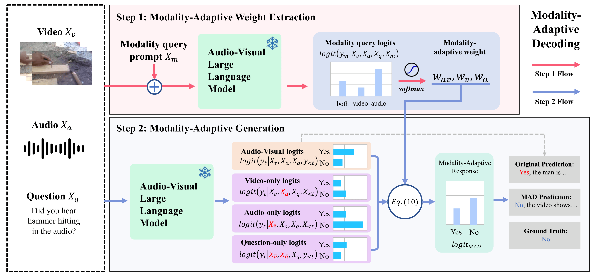

# MAD

Modality-Adaptive Decoding (MAD) is a training-free decoding method for MLLMs that adaptively weights modality-specific branches via self-assessed modality relevance, effectively reducing cross-modal hallucinations.

## What is the Problem?

| Video 1 (Visual-Driven Audio Hallucination) | Video 2 (Audio-Driven Video Hallucination) |
|----------|----------|
| <video src="assets/episode1.mp4" width="400" controls></video> | <video src="assets/episode2.mp4" width="400" controls></video> |
| The main source of sound in the video is the **~~quacking of the ducks~~** | He's holding the gun and then **~~he pulls the trigger.~~** |

Cross-modal hallucination differs from conventional hallucination in that it arises in multimodal models where multiple modalities are provided as input. Instead of generating unsupported content purely from language priors, the model produces incorrect predictions due to interference between modalities. (See related work: [AVCD](https://arxiv.org/pdf/2410.18325), [CMM](https://arxiv.org/pdf/2410.12787))

**In Video 1 (Visual-Driven Audio Hallucination)**, the scene shows a metal duck (a shooting target) being hit by a gun. However, because the model visually detects a duck, it incorrectly concludes that the primary sound source is the quacking of ducks, even though no such sound exists.

**In Video 2 (Audio-Driven Video Hallucination)**, gunshot sounds are heard in the environment. The man in the video is merely preparing to shoot, but the model assumes that he actually pulls the trigger, influenced by the audio cue.

These examples illustrate how information from one modality (visual or audio) can bias the interpretation of another, leading to cross-modal hallucinations.

## How Does It Work?



**MAD (Modality-Adaptive Decoding) works in two simple steps:**

**Step 1. Modality Weight Extraction**

The model first identifies which modality (audio, video, or both) is relevant to the question and assigns adaptive weights.

**Step 2. Adaptive Decoding**

It then computes logits under different modality settings (audio-only, video-only, full input) and fuses them using the extracted weights.

This allows the model to focus on the question-relevant modality and suppress cross-modal interference, reducing hallucinations.

## Evaluation for AVHBench and CMM

This directory contains evaluation scripts for testing the following models:

- **Qwen2.5-Omni** (3B / 7B) — `qwen-omni/`
- **VideoLLaMA2-AV** — `VideoLLaMA2/`

### Setup

#### Qwen2.5-Omni
```bash
pip install transformers accelerate tqdm
```

#### VideoLLaMA2-AV
Follow the [**VideoLLaMA2 repository**](https://github.com/DAMO-NLP-SG/VideoLLaMA2/tree/audio_visual) setup guide (audio-visual branch)

### Usage

#### Qwen2.5-Omni

**Baseline Evaluation (AVHBench)**
```bash
# Audio-video evaluation
accelerate launch qwen-omni/eval_batch.py \
    --model-path Qwen/Qwen2.5-Omni-7B \
    --modal-type av

# Audio-only / Video-only evaluation
accelerate launch qwen-omni/eval_batch.py --model-path Qwen/Qwen2.5-Omni-7B --modal-type a
accelerate launch qwen-omni/eval_batch.py --model-path Qwen/Qwen2.5-Omni-7B --modal-type v

# With memory optimization
accelerate launch qwen-omni/eval_batch.py \
    --model-path Qwen/Qwen2.5-Omni-7B \
    --modal-type av --load-4bit --disable-talker
```

**MAD Evaluation (AVHBench)**
```bash
accelerate launch qwen-omni/eval_batch_mad.py \
    --model-path Qwen/Qwen2.5-Omni-7B \
    --modal-type av \
    --use-contrast-decode \
    --gamma 2.5
```

**Baseline Evaluation (CMM)**
```bash
accelerate launch qwen-omni/eval_batch_cmm.py \
    --model-path Qwen/Qwen2.5-Omni-7B \
    --modal-type av \
    --category over-reliance_unimodal_priors
```

**MAD Evaluation (CMM)**
```bash
accelerate launch qwen-omni/eval_batch_cmm_mad.py \
    --model-path Qwen/Qwen2.5-Omni-7B \
    --modal-type av \
    --category over-reliance_unimodal_priors \
    --gamma 2.5
```

#### VideoLLaMA2-AV

**Baseline Evaluation (AVHBench)**
```bash
accelerate launch VideoLLaMA2/eval_batch.py --modal-type av
```

**MAD Evaluation (AVHBench)**
```bash
accelerate launch VideoLLaMA2/eval_batch_mad.py \
    --modal-type av \
    --gamma 2.5
```

**Baseline Evaluation (CMM)**
```bash
accelerate launch VideoLLaMA2/eval_batch_cmm.py \
    --modal-type av \
    --category over-reliance_unimodal_priors
```

**MAD Evaluation (CMM)**
```bash
accelerate launch VideoLLaMA2/eval_batch_cmm_mad.py \
    --modal-type av \
    --category over-reliance_unimodal_priors \
    --gamma 2.5
```

#### Multi-GPU

```bash
accelerate launch --num_processes 4 qwen-omni/eval_batch_mad.py \
    --model-path Qwen/Qwen2.5-Omni-7B \
    --modal-type av \
    --use-contrast-decode \
    --gamma 2.5
```

### Output Format

Results are saved as JSON files with the following structure:

```json
[
  {
    "video_id": "01162",
    "task": "AV Matching",
    "question": "Are the contexts of audio and visual content matching?",
    "ground_truth": "No",
    "prediction": "No, the audio and visual content do not match...",
    "inference_time": 2.45,
    "device": "cuda:0"
  }
]
```

### Scoring

```bash
# AVHBench scoring
python qwen-omni/score.py --f <result_json>

# CMM scoring
python qwen-omni/score_cmm.py --f <result_json>
```

### Performance Tips

1. **Memory Usage**: Use `--disable-talker` if you only need text outputs (Qwen2.5-Omni only)
2. **Speed**: Increase `--batch-size` if memory allows (default: 1)
3. **Multi-GPU**: Use `accelerate launch --num_processes N` for N GPUs

### Troubleshooting

**Memory Issues**
- Use `--load-4bit` for reduced memory footprint
- Reduce `--batch-size` to 1
- Enable `--disable-talker` (Qwen2.5-Omni only)

**Performance Issues**
- Check CUDA compatibility
- Ensure proper GPU utilization with `nvidia-smi`
- Use multiple GPUs with accelerate
